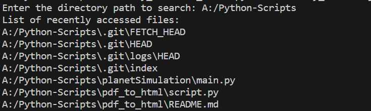

# recently_accessed_files

## Introduction

This Python script that extracts the path of recently accessed files in the specified directory.

## Usage

### Prerequisites

Before using this script, ensure you have the following:

- Python installed on your system.
- Required libraries: `os`, `datetime`

### Running the Script

1. Run this script in your terminal.

```python
$ python recently_accessed_files.py
```
2. After running the python script we have to provide the desired directory from which we want to extract the paths.
   
```python
$ Enter the directory path to search:
```
3. Example Output



### Information about  .py file

1. `get_file_access_time` function
   
- This function provides the time, in seconds since the Unix epoch, when the file was last accessed.
- Args :
    - **file_path**: provided directory path
- Returns:
    - access time

1. `get_recently_accessed_files` function
   
- This function returns a list of recently accessed files in the given directory and its subdirectories, sorted by their access time in descending order.
  
- Args :
    - **directory_path**: The path to the directory to search.
    - **time_threshold**: The time threshold in seconds since the Unix epoch. Only files accessed   after the time threshold will be returned. If `None`, all files will be returned.

- Returns:
    - A list of file paths, sorted by their access time in descending order.

### Output

The script will create a list of recently accessed files.

### Example

  - file1.txt
  - file2.txt
  - file3.txt
  - file4.txt
  - file5.txt
  - file6.txt
<!-- Updated README links and corrected typos -->
<!-- Updated README links and corrected typos -->


### Explanation of Refactoring

1. **Single Responsibility Principle (SRP)**: Each class has a single responsibility. For example, `FileAccess` deals only with file access times, while `RecentFileCollector` collects recently accessed files.

2. **Open-Closed Principle (OCP)**: The system is open for extension. For instance, if you want to add different methods of file access (e.g., a mock file access class for testing), you can simply create a new subclass of `FileAccess`.

3. **Liskov Substitution Principle (LSP)**: Any new subclass of `FileAccess` can replace existing implementations without changing the behavior of the client code.

4. **Dependency Inversion Principle (DIP)**: The `FileSystemTraverser` and `RecentFileCollector` depend on abstractions (`FileAccess`), not concrete implementations. This allows for greater flexibility.

5. **Facade Pattern**: `FileAccessFacade` provides a simplified interface to the complex subsystem of file access and collection.

6. **Visitor Pattern**: The `FileVisitor` base class allows for operations on files without exposing their internals. This theme can be extended to introduce other behaviors easily.

### .env File Example

To provide the necessary configurations via environment variables, create a `.env` file with the following variable:

```
TIME_THRESHOLD=1680000000  # Example timestamp (in seconds since epoch)
```
